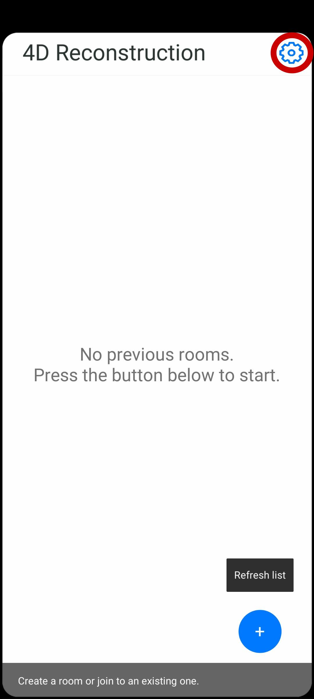
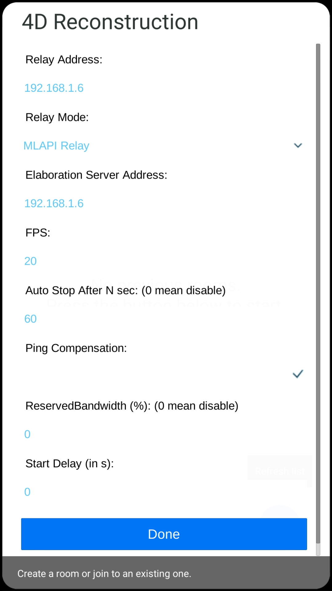
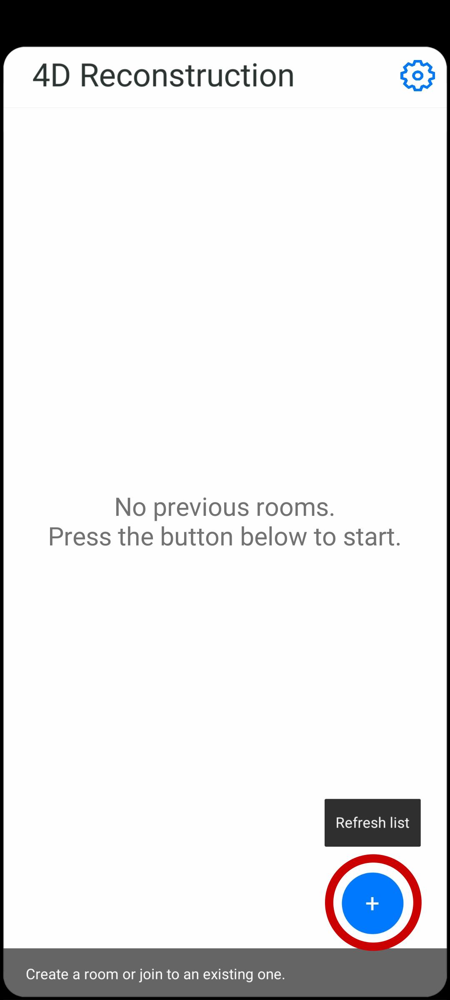

# Android application usage

Once the application was installed, if you start you should see the main screen:


On the top you can see the button that open the setting page:



The first time it is necessary to set or regulate inside the settings of each phone that participate to the session, a series of parameters:

- **Relay Address**: The IP address of the server where the MLAPI-docker relay is located. You can discovery it, by running on the server the command ```ip address```. It can be also a DNS entry
- **Elaboration Server Address**: The IP address of the server where the elaboration server is located. You can discovery it, by running on the server the command ```ip address```. It can be also a DNS entry
- **FPS**: The number of frame per second to acquire during the session
- **Auto Stop After N sec**: The number of second to wait before the host automatically stop the session. It is useful when it is necessary to make some test and we want to acquire a set amount of frame between sessions
- **Ping Compensation**: Enable disable the latency compensation system, we suggest to leave it on.
- **Reserved bandwidth**: How much bandwidth must be reserved to the trigger sending (for more detail about this aspect please reference to the paper)
- **Start delay**: How much time wait after the recording starting button is pressed to really staring acquiring the session (useful mostly for testing)

Once you setup the paprameters, you can press the done button at the bottom of the screen.



To create a new session the host need to press the plus sign on the bottom right:

